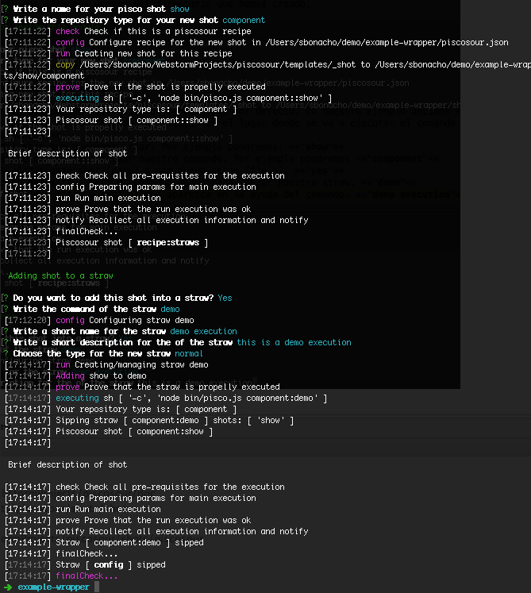

# Trabajar con shots.

Un shot es un paso de ejecución dentro de un flujo de ejecución.

Una vez creada nuestra receta nos situamos dentro del directorio que hemos creado.

    cd example-wrapper
    pisco config
    
pisco config nos ayuda a configurar nuestra receta.


1. Nos pregunta si queremos establecer un nuevo tipo de repositorio por defecto. En nuestro ejemplo decimos **"yes"**
2. Nos pregunta el tipo de repositorio. El tipo de repositorio es el lugar donde se va a ejecutar el comando pisco. Normalmente se ejecutará en la raiz de un repositorio git. [Ver que es piscosour para el glosario de términos](what_is_piscosour.md).
Por ejemplo pondremos **"component"**  
3. Pregunta por el nombre del shot que queremos crear. Por ejemplo pondremos: **"show"**
4. El tipo de repositorio sobre el que va a actuar nuestro comando. Por ejemplo pondremos **"component"**
5. Nos pregunta si queremos añadir este shot (paso) a una nueva straw (flujo). **"yes"**
6. Nos pregunta por el comando del straw. Será el comando usado para lanzar nuestra straw. **"demo"**
7. Establecemos el nombre corto del comando será el que aparezca en la ayuda del comando. **"demo execution"**
8. Nos pide una descripción para el comando. **"this is a demo execution"**
9. Seleccionar el tipo de straw que vamos a crear. **"normal"**

Listo! ya tenemos nuestro nuevo comando añadido! Pruebalo.

    node bin/pisco.js

ahora aparecerá en la ayuda de nuestra receta el nuevo comando.


    node bin/pisco.js demo

Ejecutará el nuevo straw que hemos creado con un solo shot


## Echemos un vistazo a lo que hemos creado.

Se ha generado un módulo node con su package.json y los archivos fundamentales de pisco.

Este es el árbol resultante.


 
package.json:
```js
{
  "name": "example-wrapper",
  "version": "0.0.1",
  "description": "This is my first piscosour wrapper example",
  "main": "bin/pisco.js",
  "scripts": {
    "deps": "npm install"
  },
  "keywords": [
    "piscosour-recipe"
  ],
  "license": "ISC",
  "preferGlobal": true,
  "bin": {
    "example-tool": "bin/pisco.js"
  },
  "dependencies": {
    "piscosour": "~0.1.0"
  },
  "engines": {
    "node": ">=4.0.0"
  }
}
```

El shot generado tiene esta pinta.

```js
'use strict';

var piscosour = require('piscosour'),
    Shot = piscosour.Shot;

var shot = new Shot({
    description : "Brief description of shot",

    check : function(){
        shot.logger.info("#magenta","check","Check all pre-requisites for the execution");
    },

    config : function(){
        shot.logger.info("#magenta","config","Preparing params for main execution");
    },

    run : function(){
        shot.logger.info("#magenta","run","Run main execution");
    },

    prove : function(){
        shot.logger.info("#magenta","prove","Prove that the run execution was ok");
    },

    notify : function(){
        shot.logger.info("#magenta","notify","Recollect all execution information and notify");
    }

});

module.exports = shot;
```

puedes ver este ejemplo aquí

[see this example in github](https://github.com/cellsjs/piscosour-examples)